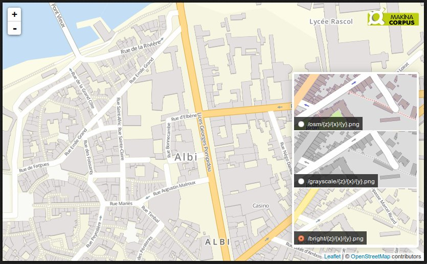

OpenStreetMap Mirror
====================

Up-to-date OpenStreetMap tile server, with various map styles.

Main Purpose
------------

* Provide an easy way to setup the full stack ;
* Targetted for small areas (e.g. cities) ;
* Automatic updates on specified extent ;
* One configuration file to handle ;
* Small preview page app using Leaflet.

Install
-------

Requirements

* Ubuntu 12.04 LTS
* 2 CPUs
* 2Go RAM
* 10Go disk
* Fast Internet connection

Just run the following commands :

    curl https://raw.github.com/makinacorpus/osm-mirror/master/install.sh > install.sh
    chmod +x install.sh
    sudo ./install.sh

**That's it !** Access your server URL.

You will be prompted for an extent (xmin,ymin,xmax,ymax). The default one is the city of Albi.
Use the [OpenStreetMap extent tool](http://www.openstreetmap.org/export#map=17/43.92751/2.14760) for help.

A lot of data will be downloaded (Approx. 1Go).

A planned task will be setup to **overwrite** the whole database with up-to-date
OpenStreetMap data, every month (*root crontab*).

Use the tiles in Leaflet
------------------------

    var map = L.map('map').setView([43.92751, 2.14760], 14);

    L.tileLayer('http://SERVER/STYLE/{z}/{x}/{y}.png', {
        attribution: '&copy; <a href="http://osm.org/copyright">OpenStreetMap</a> contributors'
    }).addTo(map);

Use the tiles in OpenLayers 3
-----------------------------

    var map = new ol.Map({
        target: 'map',
        layers: [
            new ol.layer.Tile({
                attributions: [new ol.Attribution({
                  html: '&copy; <a href="http://osm.org/copyright">OpenStreetMap</a> contributors'
                })],
                source: new ol.source.XYZ({
                    url: 'http://SERVER/STYLE/{z}/{y}/{x}.png'
                })
            })
        ],
        view: new ol.View2D({
          center: ol.proj.transform([43.92751, 2.14760], 'EPSG:4326', 'EPSG:3857'),
          zoom: 14
        })
    });

Change extent
-------------

Edit the ``EXTENT`` value in ``/etc/default/openstreetmap-conf``.

Update the configuration :

    sudo ./update-conf.sh

Refresh the data on the new extent :

    sudo ./update-data.sh

Generate GeoTiff rasters
------------------------

Generate a raster file on the extent at the specified scale :

    ./render-raster.sh osm osm-25000

Will render the style ``osm`` into ``osm-25000.tif``, on the extent stored
in configuration file at the default scale (*1:25000*).

Extent and scale can be specified as options :

    ./render-raster.sh osm osm-7000 --scale=7000 --extent=-180 90 180 -90

Add new style from TileMill
---------------------------

Create a style with Tilemill, export it as Mapnik XML ( *osm2pgsql flavor* ).

Post-process the XML file :

* remove the ``<Parameters>`` bloc ( *Mapnik 2.0 compatibility* )
* fix the Shapefile paths to ``/usr/share/mapnik-osm-data/world_boundaries/``

Copy the whole folder into ``styles/``. Name the ``.xml`` file with the same
name as the folder.

Update the configuration :

    sudo ./update-conf.sh

Known limitations
-----------------

* All stylesheets and scripts use *localhost* for database

Credits
-------

* [OSM Carto](https://github.com/gravitystorm/openstreetmap-carto), by gravitystorm
* [OSM Bright](https://github.com/mapbox/osm-bright), by MapBox

Authors
-------

* Frédéric Bonifas
* Mathieu Leplâtre

